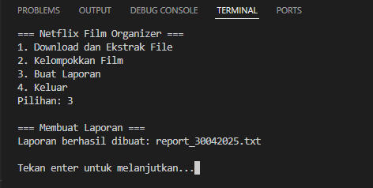
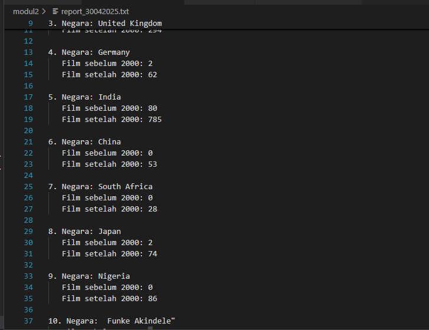

# 2. Organize and Analyze Anthony's Favorite Films
## Penyelesaian
## A. One Click and Done

Pada soal 2a, kita diminta untuk membuat skrip yang mengotomatiskan proses download, ekstrak, dan menghapus file ZIP jika tidak diperlukan hanya dengan satu perintah. 

### 1. Download 

 ```
    int downloadFile(){
      
    CURL *curl = curl_easy_init();
    if (!curl) return -1;

    struct MemoryStruct chunk = {malloc(1), 0};
    curl_easy_setopt(curl, CURLOPT_URL, ZIP_URL);
    curl_easy_setopt(curl, CURLOPT_WRITEFUNCTION, WriteMemoryCallback);
    curl_easy_setopt(curl, CURLOPT_WRITEDATA, &chunk);
    curl_easy_setopt(curl, CURLOPT_FOLLOWLOCATION, 1L);

    CURLcode res = curl_easy_perform(curl);
    if (res != CURLE_OK) {
        fprintf(stderr, "Download failed: %s\n", curl_easy_strerror(res));
        free(chunk.memory);
        curl_easy_cleanup(curl);
        return -1;
    }

    FILE *fp = fopen(ZIP_FILENAME, "wb");
    if (!fp) {
        perror("File open failed");
        free(chunk.memory);
        curl_easy_cleanup(curl);
        return -1;
    }
    fwrite(chunk.memory, 1, chunk.size, fp);
    fclose(fp);
    free(chunk.memory);
    curl_easy_cleanup(curl);
    return 0;
    }
  ```
Dalam fungsi ini, file akan didownload dengan ``libcurl`` lalu data dari file tersebut akan disimpan dalam buffer memori ``chunk``. Jika unduhan gagal, maka akan menampilkan pesan error dan akan langsung keluar dari fungsi. Jika berhasil, data yang telah diunduh tadi akan ditulis ke dalam file lokal(netflixData.zip).

### 2. Extract Zip

```
int extract_zip() {
    int err = 0;
    struct zip *za = zip_open(ZIP_FILENAME, 0, &err);
    if (!za) return -1;

    makedir(EXTRACT_FOLDER);
    for (int i = 0; i < zip_get_num_entries(za, 0); i++) {
        struct zip_stat sb;
        if (zip_stat_index(za, i, 0, &sb) != 0) continue;

        char filepath[MAX_PATH_LEN];
        snprintf(filepath, sizeof(filepath), "%s/%s", EXTRACT_FOLDER, sb.name);

        char *slash = strrchr(filepath, '/');
        if (slash) {
            *slash = '\0';
            makedir(filepath);
            *slash = '/';
        }

        struct zip_file *zf = zip_fopen_index(za, i, 0);
        if (!zf) continue;

        int fd = open(filepath, O_WRONLY | O_CREAT | O_TRUNC, 0644);
        if (fd >= 0) {
            char buf[4096];
            zip_int64_t len;
            while ((len = zip_fread(zf, buf, sizeof(buf))) > 0) {
                write(fd, buf, len);
            }
            close(fd);
        }
        zip_fclose(zf);
    }
    zip_close(za);
    return 0;
}
```
Pada fungsi ini, file zip yang sudah diunduh di fungsi `downloadFile` akan dibuka dengan `struct zip *za = zip_open(ZIP_FILENAME, 0, &err);`. Kemudian kita akan membuat folder baru dengan `makedir` untuk 
menempatkan file hasil extract. Lalu, akan dilakukan for-loop untuk melakukan iterasi ke semua file di dalam file zip  dengan `zip_get_num_entries` dan isi file tersebut akan dibaca dengan `zip_read` dan didtulis  ke dalam file lokal dengan `write`.

### 3. Download and Extract
```
void download_and_extract() {
    printf("\n=== Download dan Ekstrak File ===\n");
    if (downloadFile() == 0 && extract_zip() == 0) {
        remove(ZIP_FILENAME);
        printf("File berhasil diunduh dan diekstrak ke folder '%s'\n", EXTRACT_FOLDER);
    } else {
        printf("Terjadi kesalahan dalam proses download atau ekstrak\n");
    }
    printf("\nTekan enter untuk melanjutkan..."); getchar();
}
```
Fungsi ini berguna untuk membuat proses download serta extract file dalam satu perintah saja. Jika proses dwonload dan extract berhasil, maka file zip akan dihapus dengan `remove(ZIP_FILENAME);`. Namun, jika hanya salah satu proses yang berhasil atau kedua proses gagal, maka akan menampilkan `Terjadi kesalahan dalam proses download atau ekstrak`.

### 4. Output

.png)

.png)


## B. Sorting Like a Pro
### 1. Huruf
```
void *sortTitle(void *arg) {
    makedir("judul");
    for (int i = 0; i < film_count; i++) {
        char ch = toupper(films[i].title[0]);
        char filename[20];
        if (isalnum(ch)) snprintf(filename, sizeof(filename), "judul/%c.txt", ch);
        else strcpy(filename, "judul/#.txt");

        logmsg("Abjad", films[i].title);

        FILE *fp = fopen(filename, "a");
        if (fp) {
            fprintf(fp, "%s - %d - %s\n", films[i].title, films[i].year, films[i].director);
            fclose(fp);
        }
    }
    return NULL;
}
```
Di fungsi ini, kita akan membuat folder 'judul' untuk menyimpan hasil judul film yang sudah disortir berdasarkan abjad dengan ``makedir``. ``for-loop`` akan melakukan iterasi ke seluruh data film yang jumlahnya ``film_count``. Lalu, karakter pertama dari judul film akan diambil dan diubah menjadi huruf kapital dengan ``char ch = toupper(films[i].title[0]);``. Karakter pertama dari judul film akan diperiksa apakah alfabet, numerik, atau bukan keduanya. Jika berupa alfabet atau numerik, maka akan dibuat file dengan format nama `judul/%c.txt`(misal A.txt). Namun, jika tidak keduanya maka akan diatur ke `judul/#.txt`. Kemudian fungsi `logmsg("Abjad", films[i].title);` dipanggil untuk mencatat bahwa film sedang dikelompokkan berdasarkan judul. Terakhir, data film akan dituliskan ke dalam file dengan format `judul-tahun-sutradara`.

### 2. Tahun
```
void *sortYear(void *arg) {
    makedir("tahun");
    for (int i = 0; i < film_count; i++) {
        char filename[20];
        snprintf(filename, sizeof(filename), "tahun/%d.txt", films[i].year);
        logmsg("Tahun", films[i].title);

        FILE *fp = fopen(filename, "a");
        if (fp) {
            fprintf(fp, "%s - %d - %s\n", films[i].title, films[i].year, films[i].director);
            fclose(fp);
        }
    }
    return NULL;
}
```
Fungsi sortYear adalah fungsi yang berjalan dalam thread untuk mengelompokkan data film berdasarkan tahun rilis ke dalam file teks di folder tahun. Folder tahun dibuat menggunakan fungsi `makedir` jika belum ada. Fungsi ini mengiterasi melalui array global films sebanyak `film_count` kali menggunakan for-loop. Untuk setiap film, nama file dibentuk dengan format `tahun/%d.txt` berdasarkan nilai `films[i].year` (misalnya, tahun/2000.txt untuk tahun 2000). File dibuka dalam mode append ("a") untuk menambahkan data tanpa menghapus konten sebelumnya. Jika file berhasil dibuka, data film ditulis dalam format judul - tahun - sutradara (contoh: Avengers - 2012 - Joss Whedon). Aktivitas pengelompokan dicatat ke file log menggunakan logmsg("Tahun", films[i].title). 

### 3. Log Message
```
void logmsg(const char *category, const char *film_title) {
    time_t now = time(NULL);
    struct tm *t = localtime(&now);
    pthread_mutex_lock(&log_mutex);
    FILE *logmsg = fopen("log.txt", "a");
    if (logmsg) {
        fprintf(logmsg, "[%02d:%02d:%02d] Proses mengelompokkan berdasarkan %s: sedang mengelompokkan untuk film %s\n",
                t->tm_hour, t->tm_min, t->tm_sec, category, film_title);
        fclose(logmsg);
    }
    pthread_mutex_unlock(&log_mutex);
}
```
Fungsi logmsg digunakan untuk mencatat aktivitas pengelompokan data film ke dalam file `log.txt`. Fungsi ini menulis pesan log dengan format yang mencakup stempel waktu, kategori pengelompokan (misalnya, "Abjad" atau "Tahun"), dan judul film yang sedang diproses. Fungsi ini dirancang untuk thread-safe dengan menggunakan mutex (pthread_mutex_t) untuk mencegah konflik akses file saat dijalankan dalam kondisi multithreaded, seperti saat digunakan bersama fungsi sortTitle dan sortYear. Contohnya, program memproses `logmsg("Abjad", "Avengers");` maka isi log.txt nya akan seperti `[09:05:23] Proses mengelompokkan berdasarkan Abjad: sedang mengelompokkan untuk film Avengers`.

### 4. Output


## C. Ultimate Movie Report

### 1. Reports
```
void generate_report() {
    if (film_count == 0) {
        printf("Tidak ada film untuk dilaporkan.\n");
        return;
    }
    country_count = 0;
    for (int i = 0; i < film_count; i++) {
        int found = 0;
        for (int j = 0; j < country_count; j++) {
            if (strcmp(countries[j].name, films[i].country) == 0) {
                found = 1;
                if (films[i].year < 2000) countries[j].before_2000++;
                else countries[j].after_2000++;
                break;
            }
        }
        if (!found && country_count < MAX_COUNTRIES) {
            strncpy(countries[country_count].name, films[i].country, MAX_LINE);
            countries[country_count].before_2000 = films[i].year < 2000 ? 1 : 0;
            countries[country_count].after_2000 = films[i].year >= 2000 ? 1 : 0;
            country_count++;
        }
    }
    time_t now = time(NULL);
    struct tm *t = localtime(&now);
    char report_filename[50];
    snprintf(report_filename, sizeof(report_filename), "report_%02d%02d%04d.txt",
             t->tm_mday, t->tm_mon + 1, t->tm_year + 1900);

    FILE *report = fopen(report_filename, "w");
    if (!report) {
        perror("Gagal membuat laporan");
        return;
    }
    for (int i = 0; i < country_count; i++) {
        fprintf(report, "%d. Negara: %s\n", i + 1, countries[i].name);
        fprintf(report, "   Film sebelum 2000: %d\n", countries[i].before_2000);
        fprintf(report, "   Film setelah 2000: %d\n\n", countries[i].after_2000);
    }
    fclose(report);
    printf("Laporan berhasil dibuat: %s\n", report_filename);
}
```
Fungsi `generate_report` berfungsi untuk mengelompokkan film berdasarkan negara dan menghitung jumlah film sebelum dan setelah tahun 2000 untuk setiap negara menggunakan `for-loop`.  Laporan disimpan dalam file teks dengan nama yang dibentuk berdasarkan tanggal saat ini (format: report_DDMMYYYY.txt).

```
void load_films() {
    film_count = 0;
    DIR *dir = opendir(EXTRACT_FOLDER);
    if (!dir) return;
    struct dirent *ent;
    while ((ent = readdir(dir)) != NULL) {
        if (strcmp(ent->d_name, ".") == 0 || strcmp(ent->d_name, "..") == 0) continue;
        if (!strstr(ent->d_name, ".csv")) continue;

        char filepath[MAX_PATH_LEN];
        snprintf(filepath, sizeof(filepath), "%s/%s", EXTRACT_FOLDER, ent->d_name);

        FILE *fp = fopen(filepath, "r");
        if (!fp) continue;

        char line[MAX_LINE];
        while (fgets(line, sizeof(line), fp)) {
            char *token = strtok(line, ",");
            if (!token) continue;
            strncpy(films[film_count].title, token, MAX_LINE);

            token = strtok(NULL, ",");
            if (!token) continue;
            strncpy(films[film_count].director, token, MAX_LINE);

            token = strtok(NULL, ",");
            if (!token) continue;
            strncpy(films[film_count].country, token, MAX_LINE);

            token = strtok(NULL, "\n");
            if (!token) continue;
            films[film_count].year = atoi(token);

            if (++film_count >= MAX_FILMS) break;
        }
        fclose(fp);
    }
    closedir(dir);
}
```
Fungsi `load_films` bertugas memuat data film dari file CSV yang terdapat dalam direktori tertentu (`EXTRACT_FOLDER`). Fungsi ini membaca setiap file CSV di direktori tersebut, mem-parsing baris demi baris untuk mengekstrak informasi film (judul, sutradara, negara, dan tahun rilis), dan menyimpan data tersebut ke dalam array global `films`.

```
void report() {
    printf("\n=== Membuat Laporan ===\n");
    load_films();
    generate_report();
    printf("\nTekan enter untuk melanjutkan..."); getchar();
}
```
Fungsi ini akan menampilkan pesan bahwa laporan sedang dibuat dan menjalankan proses pembuatan laporan dengan memanggil fungsi `load_films` dan juga `generate_report`.

### 2. Terminal Interaktif
```
void menu() {
    int choice;
    while (1) {
        printf("\033[H\033[J");
        printf("=== Netflix Film Organizer ===\n");
        printf("1. Download dan Ekstrak File\n");
        printf("2. Kelompokkan Film\n");
        printf("3. Buat Laporan\n");
        printf("4. Keluar\n");
        printf("Pilihan: ");
        scanf("%d", &choice); getchar();

        switch (choice) {
            case 1: download_and_extract(); break;
            case 2: group_films(); break;
            case 3: report(); break;
            case 4: return;
            default:
                printf("Pilihan tidak valid!\n\nTekan enter untuk melanjutkan..."); getchar();
        }
    }
}
```
Fungsi ini menampilkan menu interaktif di terminal yang memungkinkan pengguna untuk memilih opsi seperti mengunduh dan mengekstrak file, mengelompokkan film, membuat laporan, atau keluar dari program.

### 3. Output






 


    
    


