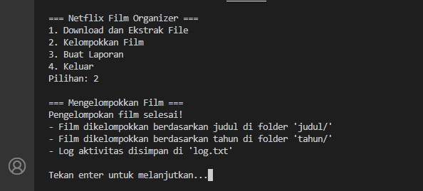
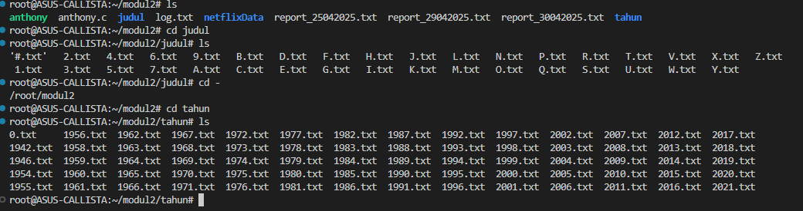
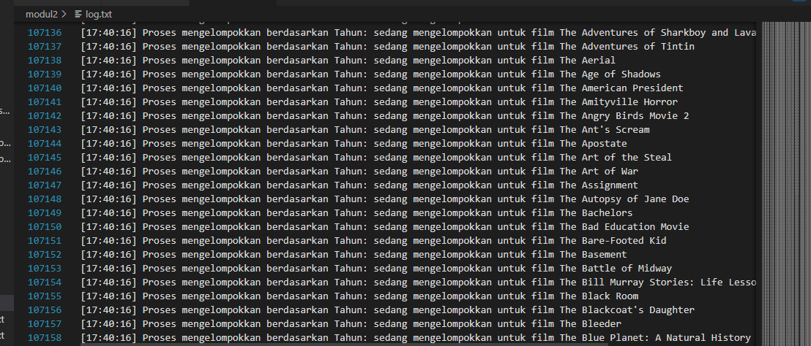

# Organize and Analyze Anthony's Favorite Films

Anthony sedang asyik menonton film favoritnya dari Netflix, namun seiring berjalannya waktu, koleksi filmnya semakin menumpuk. Ia pun memutuskan untuk membuat sistem agar film-film favoritnya bisa lebih terorganisir dan mudah diakses. Anthony ingin melakukan beberapa hal dengan lebih efisien dan serba otomatis.

> Film-film yang dimaksud adalah film-film yang ada di dalam file ZIP yang bisa diunduh dari **[Google Drive](https://drive.google.com/file/d/12GWsZbSH858h2HExP3x4DfWZB1jLdV-J/view?usp=drive_link)**.

Berikut adalah serangkaian tugas yang Anthony ingin capai untuk membuat pengalaman menonton filmnya jadi lebih menyenangkan:

### **a. One Click and Done!**

Pernahkah kamu merasa malas untuk mengelola file ZIP yang penuh dengan data film? Anthony merasa hal yang sama, jadi dia ingin semuanya serba instan dengan hanya satu perintah. Dengan satu perintah saja, Anthony bisa:

- Mendownload file ZIP yang berisi data film-film Netflix favoritnya.
- Mengekstrak file ZIP tersebut ke dalam folder yang sudah terorganisir.
- Menghapus file ZIP yang sudah tidak diperlukan lagi, supaya tidak memenuhi penyimpanan.

Buatlah skrip yang akan mengotomatiskan proses ini sehingga Anthony hanya perlu menjalankan satu perintah untuk mengunduh, mengekstrak, dan menghapus file ZIP.

### **b. Sorting Like a Pro**

Koleksi film Anthony semakin banyak dan dia mulai bingung mencari cara yang cepat untuk mengelompokkannya. Nah, Anthony ingin mengelompokkan film-filmnya dengan dua cara yang sangat mudah:

1. Berdasarkan huruf pertama dari judul film.
2. Berdasarkan tahun rilis (release year).

Namun, karena Anthony sudah mempelajari **multiprocessing**, dia ingin mengelompokkan kedua kategori ini secara paralel untuk menghemat waktu.

**Struktur Output:**

- **Berdasarkan Huruf Pertama Judul Film:**

  - Folder: `judul/`
  - Setiap file dinamai dengan huruf abjad atau angka, seperti `A.txt`, `B.txt`, atau `1.txt`.
  - Jika judul film tidak dimulai dengan huruf atau angka, film tersebut disimpan di file `#.txt`.

- **Berdasarkan Tahun Rilis:**
  - Folder: `tahun/`
  - Setiap file dinamai sesuai tahun rilis film, seperti `1999.txt`, `2021.txt`, dst.

Format penulisan dalam setiap file :

```
Judul Film - Tahun Rilis - Sutradara
```

Setiap proses yang berjalan akan mencatat aktivitasnya ke dalam satu file bernama **`log.txt`** dengan format:

```
[jam:menit:detik] Proses mengelompokkan berdasarkan [Abjad/Tahun]: sedang mengelompokkan untuk film [judul_film]
```

**Contoh Log:**

```
[14:23:45] Proses mengelompokkan berdasarkan Abjad: sedang mengelompokkan untuk film Avengers: Infinity War
[14:23:46] Proses mengelompokkan berdasarkan Tahun: sedang mengelompokkan untuk film Kung Fu Panda
```

### **c. The Ultimate Movie Report**

Sebagai penggemar film yang juga suka menganalisis, Anthony ingin mengetahui statistik lebih mendalam tentang film-film yang dia koleksi. Misalnya, dia ingin tahu berapa banyak film yang dirilis **sebelum tahun 2000** dan **setelah tahun 2000**.

Agar laporan tersebut mudah dibaca, Anthony ingin hasilnya disimpan dalam file **`report_ddmmyyyy.txt`**.

**Format Output dalam Laporan:**

```
i. Negara: <nama_negara>
Film sebelum 2000: <jumlah>
Film setelah 2000: <jumlah>

...
i+n. Negara: <nama_negara>
Film sebelum 2000: <jumlah>
Film setelah 2000: <jumlah>
```

Agar penggunaannya semakin mudah, Anthony ingin bisa menjalankan semua proses di atas melalui sebuah antarmuka terminal interaktif dengan pilihan menu seperti berikut:
1. Download File
2. Mengelompokkan Film
3. Membuat Report

Catatan:
- Dilarang menggunakan `system`
- Harap menggunakan thread dalam pengerjaan soal C
---

## Penyelesaian
## A. One Click and Done

Pada soal 2a, kita diminta untuk membuat skrip yang mengotomatiskan proses download, ekstrak, dan menghapus file ZIP jika tidak diperlukan hanya dengan satu perintah. 

### 1. Download 

 ```
    int downloadFile(){
      
    CURL *curl = curl_easy_init();
    if (!curl) return -1;

    struct MemoryStruct chunk = {malloc(1), 0};
    curl_easy_setopt(curl, CURLOPT_URL, ZIP_URL);
    curl_easy_setopt(curl, CURLOPT_WRITEFUNCTION, WriteMemoryCallback);
    curl_easy_setopt(curl, CURLOPT_WRITEDATA, &chunk);
    curl_easy_setopt(curl, CURLOPT_FOLLOWLOCATION, 1L);

    CURLcode res = curl_easy_perform(curl);
    if (res != CURLE_OK) {
        fprintf(stderr, "Download failed: %s\n", curl_easy_strerror(res));
        free(chunk.memory);
        curl_easy_cleanup(curl);
        return -1;
    }

    FILE *fp = fopen(ZIP_FILENAME, "wb");
    if (!fp) {
        perror("File open failed");
        free(chunk.memory);
        curl_easy_cleanup(curl);
        return -1;
    }
    fwrite(chunk.memory, 1, chunk.size, fp);
    fclose(fp);
    free(chunk.memory);
    curl_easy_cleanup(curl);
    return 0;
    }
  ```
Dalam fungsi ini, file akan didownload dengan ``libcurl`` lalu data dari file tersebut akan disimpan dalam buffer memori ``chunk``. Jika unduhan gagal, maka akan menampilkan pesan error dan akan langsung keluar dari fungsi. Jika berhasil, data yang telah diunduh tadi akan ditulis ke dalam file lokal(netflixData.zip).

### 2. Extract Zip

```
int extract_zip() {
    int err = 0;
    struct zip *za = zip_open(ZIP_FILENAME, 0, &err);
    if (!za) return -1;

    makedir(EXTRACT_FOLDER);
    for (int i = 0; i < zip_get_num_entries(za, 0); i++) {
        struct zip_stat sb;
        if (zip_stat_index(za, i, 0, &sb) != 0) continue;

        char filepath[MAX_PATH_LEN];
        snprintf(filepath, sizeof(filepath), "%s/%s", EXTRACT_FOLDER, sb.name);

        char *slash = strrchr(filepath, '/');
        if (slash) {
            *slash = '\0';
            makedir(filepath);
            *slash = '/';
        }

        struct zip_file *zf = zip_fopen_index(za, i, 0);
        if (!zf) continue;

        int fd = open(filepath, O_WRONLY | O_CREAT | O_TRUNC, 0644);
        if (fd >= 0) {
            char buf[4096];
            zip_int64_t len;
            while ((len = zip_fread(zf, buf, sizeof(buf))) > 0) {
                write(fd, buf, len);
            }
            close(fd);
        }
        zip_fclose(zf);
    }
    zip_close(za);
    return 0;
}
```
Pada fungsi ini, file zip yang sudah diunduh di fungsi `downloadFile` akan dibuka dengan `struct zip *za = zip_open(ZIP_FILENAME, 0, &err);`. Kemudian kita akan membuat folder baru dengan `makedir` untuk 
menempatkan file hasil extract. Lalu, akan dilakukan for-loop untuk melakukan iterasi ke semua file di dalam file zip  dengan `zip_get_num_entries` dan isi file tersebut akan dibaca dengan `zip_read` dan didtulis  ke dalam file lokal dengan `write`.

### 3. Download and Extract
```
void download_and_extract() {
    printf("\n=== Download dan Ekstrak File ===\n");
    if (downloadFile() == 0 && extract_zip() == 0) {
        remove(ZIP_FILENAME);
        printf("File berhasil diunduh dan diekstrak ke folder '%s'\n", EXTRACT_FOLDER);
    } else {
        printf("Terjadi kesalahan dalam proses download atau ekstrak\n");
    }
    printf("\nTekan enter untuk melanjutkan..."); getchar();
}
```
Fungsi ini berguna untuk membuat proses download serta extract file dalam satu perintah saja. Jika proses dwonload dan extract berhasil, maka file zip akan dihapus dengan `remove(ZIP_FILENAME);`. Namun, jika hanya salah satu proses yang berhasil atau kedua proses gagal, maka akan menampilkan `Terjadi kesalahan dalam proses download atau ekstrak`.

### 4. Output

.png)

.png)


## B. Sorting Like a Pro
### 1. Huruf
```
void *sortTitle(void *arg) {
    makedir("judul");
    for (int i = 0; i < film_count; i++) {
        char ch = toupper(films[i].title[0]);
        char filename[20];
        if (isalnum(ch)) snprintf(filename, sizeof(filename), "judul/%c.txt", ch);
        else strcpy(filename, "judul/#.txt");

        logmsg("Abjad", films[i].title);

        FILE *fp = fopen(filename, "a");
        if (fp) {
            fprintf(fp, "%s - %d - %s\n", films[i].title, films[i].year, films[i].director);
            fclose(fp);
        }
    }
    return NULL;
}
```
Di fungsi ini, kita akan membuat folder 'judul' untuk menyimpan hasil judul film yang sudah disortir berdasarkan abjad dengan ``makedir``. ``for-loop`` akan melakukan iterasi ke seluruh data film yang jumlahnya ``film_count``. Lalu, karakter pertama dari judul film akan diambil dan diubah menjadi huruf kapital dengan ``char ch = toupper(films[i].title[0]);``. Karakter pertama dari judul film akan diperiksa apakah alfabet, numerik, atau bukan keduanya. Jika berupa alfabet atau numerik, maka akan dibuat file dengan format nama `judul/%c.txt`(misal A.txt). Namun, jika tidak keduanya maka akan diatur ke `judul/#.txt`. Kemudian fungsi `logmsg("Abjad", films[i].title);` dipanggil untuk mencatat bahwa film sedang dikelompokkan berdasarkan judul. Terakhir, data film akan dituliskan ke dalam file dengan format `judul-tahun-sutradara`.

### 2. Tahun
```
void *sortYear(void *arg) {
    makedir("tahun");
    for (int i = 0; i < film_count; i++) {
        char filename[20];
        snprintf(filename, sizeof(filename), "tahun/%d.txt", films[i].year);
        logmsg("Tahun", films[i].title);

        FILE *fp = fopen(filename, "a");
        if (fp) {
            fprintf(fp, "%s - %d - %s\n", films[i].title, films[i].year, films[i].director);
            fclose(fp);
        }
    }
    return NULL;
}
```
Fungsi sortYear adalah fungsi yang berjalan dalam thread untuk mengelompokkan data film berdasarkan tahun rilis ke dalam file teks di folder tahun. Folder tahun dibuat menggunakan fungsi `makedir` jika belum ada. Fungsi ini mengiterasi melalui array global films sebanyak `film_count` kali menggunakan for-loop. Untuk setiap film, nama file dibentuk dengan format `tahun/%d.txt` berdasarkan nilai `films[i].year` (misalnya, tahun/2000.txt untuk tahun 2000). File dibuka dalam mode append ("a") untuk menambahkan data tanpa menghapus konten sebelumnya. Jika file berhasil dibuka, data film ditulis dalam format judul - tahun - sutradara (contoh: Avengers - 2012 - Joss Whedon). Aktivitas pengelompokan dicatat ke file log menggunakan logmsg("Tahun", films[i].title). 

### 3. Log Message
```
void logmsg(const char *category, const char *film_title) {
    time_t now = time(NULL);
    struct tm *t = localtime(&now);
    pthread_mutex_lock(&log_mutex);
    FILE *logmsg = fopen("log.txt", "a");
    if (logmsg) {
        fprintf(logmsg, "[%02d:%02d:%02d] Proses mengelompokkan berdasarkan %s: sedang mengelompokkan untuk film %s\n",
                t->tm_hour, t->tm_min, t->tm_sec, category, film_title);
        fclose(logmsg);
    }
    pthread_mutex_unlock(&log_mutex);
}
```
Fungsi logmsg digunakan untuk mencatat aktivitas pengelompokan data film ke dalam file `log.txt`. Fungsi ini menulis pesan log dengan format yang mencakup stempel waktu, kategori pengelompokan (misalnya, "Abjad" atau "Tahun"), dan judul film yang sedang diproses. Fungsi ini dirancang untuk thread-safe dengan menggunakan mutex (pthread_mutex_t) untuk mencegah konflik akses file saat dijalankan dalam kondisi multithreaded, seperti saat digunakan bersama fungsi sortTitle dan sortYear. Contohnya, program memproses `logmsg("Abjad", "Avengers");` maka isi log.txt nya akan seperti `[09:05:23] Proses mengelompokkan berdasarkan Abjad: sedang mengelompokkan untuk film Avengers`.

### 4. Output








 


    
    


